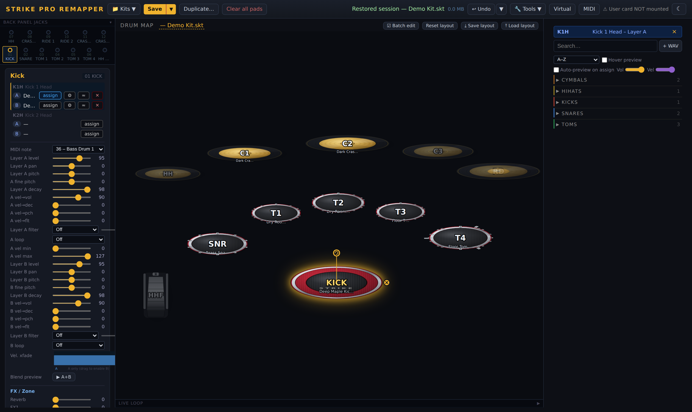

# Strike Pro Remapper


**An offline kit and instrument editor for the Alesis Strike / Strike Pro drum module.**
No module connection required. No install. No dependencies. One Python file.



The official Strike Editor hasn't been updated since January 2018, requires the module
plugged in via USB for every edit, and never worked reliably on modern macOS. This tool
replaces it: load `.skt` kit files straight from your SD card (or a synced local library),
edit everything in your browser, and write the results back — byte-for-byte lossless for
everything it doesn't touch.

> ⚠️ **Unofficial.** Not affiliated with Alesis or inMusic. The `.skt`/`.sin` formats are
> reverse-engineered. Back up your SD card before writing to it. See
> [Safety](#safety) and [Format status](#format-status) for exactly what is
> hardware-confirmed and how your files are protected.

## Quick start

Requirements: **Python 3.10+**. Standard library only — there is nothing to `pip install`.

```
git clone https://github.com/Coober666/strike-pro-remapper
cd strike-pro-remapper
python strike_remap.py        # opens http://localhost:8765 in your browser
```

Or double-click `launch.bat` (Windows) / `launch.command` (macOS).

**With your SD card:** insert it and the app finds your kits and instruments automatically
(volumes named `NO NAME` / `NO NAME 1`, or one folder level deep for Ventoy-style setups).
Use **Sync full library from SD** to copy everything into `library/` so you can edit with
no SD card present — e.g. on a laptop away from your kit.

**Without an SD card:** the app runs entirely against a local `library/` folder
(`kits/`, `instruments/`, `samples/`).

Saving writes to the library and/or directly to the SD card; put the card back in the
module and load the kit. (Live USB sync to the module is not supported — that protocol
is still unmapped. See `RESEARCH.md`.)

**Just want to look, not install anything?** Grab the read-only
[Web Viewer](#web-viewer-read-only-zero-install) — a single HTML file that runs from a
double-click.

## How it compares to the official Strike Editor

| | Official Strike Editor | Strike Pro Remapper |
|---|---|---|
| Works without the module connected | ❌ USB connection required for every edit | ✅ fully offline against SD card or local library |
| Platform | Windows/macOS desktop app, last updated Jan 2018, unreliable on modern macOS | Anything that runs Python 3.10+ and a browser |
| Startup | Multi-pass SD scan on every launch (notoriously slow) | Loads instantly; full-library sync is one click, in the background |
| Undo | None | 20-step labeled undo **plus** a persistent kit time machine (snapshot, diff, restore) |
| Velocity editing | Numeric 0–99 knobs | Visual velocity-zone lane and draggable response curves |
| Copy / batch operations | None — set three toms one at a time | Copy/swap pads, batch edit, batch assign from CSV |
| Broken sample paths | "Path not found," no remedy | Relink wizard with exact + fuzzy matching |
| Kit sharing | Bare files with absolute paths that break on other machines | Self-contained bundles (kit + instruments + samples); also imports official-editor and commercial pack zips |
| Finding sounds | Scroll the folder list | Search, tags, favorites, waveform thumbnails, audition at any velocity, **audio similarity search** |
| Hear your kit while editing | Only by writing to SD and reloading the module | **Virtual module**: play the kit from the real pads (or keyboard) via Web MIDI + Web Audio |
| Trigger settings backup | Not possible in any official tool | SysEx capture/save/restore over Web MIDI |
| Format documentation | Closed | Open spec in [FORMAT.md](FORMAT.md), round-trip tested |

## Features

**Kit editing**
- Visual drum map — realistic top-down kit (red-sparkle shells, mesh heads, chrome
  hoops/lugs, brass cymbals, hi-hat pedal); click a pad, assign instruments to Layer A/B,
  set the velocity crossfade by dragging; pads are draggable/relabelable, snare rim and
  ride bell register on and move with their parent, and any zone can show a **mirror pad**
  for Y-splitter / doubled-trigger setups (same zone, drawn twice)
- **Mock up your exact kit** — every pad is fully editable: drag to position, on-map gold
  handles to resize and rotate (Shift = snap to 15°), size/rotation sliders + a shell-finish
  / cymbal-tone picker in the pad panel (red sparkle, black, white, silver, blue, emerald,
  purple, amber, natural wood; brass / bronze / brilliant / black cymbals). Rims and bells
  inherit their parent's size, rotation, and finish. **Save layout** / **Load layout** export
  the whole arrangement to a JSON file to carry between browsers or share
- Per-layer level, pan, pitch (±12 st), fine pitch (±50 cents), decay, filter
  cutoff/enable; mute groups; MIDI notes; gate time (Free in ms, tempo-synced, or off)
- Copy, swap, and batch-edit pads; batch-assign from CSV; kit diff/compare; rename,
  duplicate, clear; 20-step undo with labeled history; autosave + crash recovery
- **Kit time machine** — a persistent version history that outlives reloads and restarts
  (the durable counterpart to in-memory undo). Snapshots are captured automatically on
  load and save, on a debounced timer while you edit, and on demand with **Snapshot now**;
  identical states are deduped and old ones age out (pin the keepers). Open the timeline
  (Kits menu → **Kit time machine…**), scrub through the history, **visually diff any two
  points** (or a point vs. your current edit), and **restore** one with a single click —
  and the restore is itself undoable, so you can never lose your place
- Kit size meter (200 MB module limit), broken-sample-path detection, export MIDI map
  as a printable cheat sheet

**Instrument (.sin) editing** — *things the official editor can also do, now offline*
- Full instrument parameters: group, level, pan, decay, semitone + fine pitch, filter
  type/cutoff, velocity→level/decay/pitch/filter response, loop flag
- **Visual velocity-zone editor** — sample mappings drawn as draggable bars on a velocity
  lane (round-robins stacked); drag a split point to retune zone boundaries, click any
  zone to audition its sample at that exact velocity; split zones, add round-robin
  variants, and delete zones from the mapping table
- **Velocity response curves** — drag the curve to set vel→Level/Decay/Pitch/Filter depth
  instead of decoding what "-43" means
- Velocity-layer mapping table with round-robin indices and hi-hat pedal-position ranges
- Round-robin vs. random cycle mode (anti-machine-gun)
- Import WAVs into new multi-velocity instruments, with optional peak normalization and
  **auto-map by loudness** (sorts samples quiet→loud and assigns velocity bands for you)
- Edits write to your local library only; factory presets stay read-only; one-click revert

**Sharing & repair**
- **Kit bundles** — export any kit as a self-contained `.zip` (kit + every referenced
  instrument + every sample + manifest). Import a bundle on another machine and it just
  works — no broken absolute paths, the problem that plagues bare `.skt` sharing.
  Existing library files are never overwritten on import.
- **Official editor & commercial pack zips** — the importer also accepts official
  Strike Editor kit/instrument exports and commercial pack zips (eDrumWorkshop,
  drum-tec, …): any zip carrying `Kits/`/`Instruments/`/`Samples/` folders (even nested
  inside a pack folder) or loose `.skt`/`.sin`/`.wav` files maps straight into the
  library, with loose WAVs placed where the imported instruments expect them.
- **Relink wizard** — when sample paths do break (renamed folders, different machine),
  it finds the missing instruments, suggests matches from your library (exact name first,
  fuzzy match second), and fixes every affected pad in one undoable step.

**Kit FX editor**
- Full editing of the kit's shared FX from the hardware-confirmed KIT-header layout:
  reverb (type/level/size/color), FX1/FX2 (type, level, feedback, depth, rate, and
  delay time for delay-family effects), EQ (LF/HF gain + freq) and compressor
  (preset/threshold/output) — all undoable, saved with the kit
- Reverb type indices 0–21 exist in factory kits but only Big Gate (2) and Close Mic (3)
  have hardware-confirmed names; the rest show as "Type N" until enumerated

**Library & workflow**
- One-click full library sync from SD card (background, with progress)
- Instrument browser: search, tag filtering, favorites, recents, waveform thumbnails,
  audio preview at any velocity, A+B layer blend preview
- **"More like this" similarity search** — instead of scrolling 168 snares, click the
  **≈** on any instrument (or a pad layer) to get the ~10 closest-*sounding* alternatives,
  ranked. Cheap audio fingerprints (spectral centroid, spectral rolloff, zero-crossing
  rate, high-frequency brightness, and RMS decay time) are computed once per instrument
  from its hardest-velocity sample; matches are cross-group, so a bright crash surfaces
  other bright long-decay cymbals — even a gong — regardless of folder. **The whole
  factory library ships pre-fingerprinted** (`factory_fingerprints.json`, ~470 KB of
  derived numbers, not audio), so this works out of the box with **no first-run scan and
  without syncing the multi-GB sample set** — only your own imported samples get
  fingerprinted, on demand. Read-only — no WAV/`.sin`/`.skt` is ever modified.
- Live loop step-sequencer to audition a kit groove while you edit
- MIDI monitor: hit a pad on the actual kit and watch it light up (Web MIDI, Chromium)
- **Virtual module** — play the kit you're editing straight from the real drum pads, before
  writing anything to the SD card. Toggle it on (button next to MIDI) and a MIDI note-on
  matches its pad, resolves Layer A/B by velocity, and plays the right samples in the
  browser via Web Audio — killing the edit → save → SD → module-reload loop. No hardware?
  Number keys **1–0** fire the first ten pads at a velocity slider, so it's demoable
  standalone. Samples are pre-decoded when you enable it (progress on the button; kits over
  ~100 MB decode lazily on first hit), and the manifest refreshes automatically as you edit.
  Chromium only. What it reproduces:
  - **Simulated:** velocity zones, round-robin/random cycling, Layer A/B ranges + crossfade
    entry (`xfade_vel`), per-layer level & pan, semitone + fine pitch, mute-group choke
    (open/closed hi-hat), Mono vs. Poly.
  - **Approximated:** decay (a gain envelope, not the module's exact shaping), the
    velocity→loudness curve (a fixed curve; the module's per-pad vel→volume depth isn't
    applied), hi-hat pedal position (filtered by CC #4).
  - **Not simulated:** module FX (reverb / FX1 / FX2 / EQ, kit- or pad-level), the
    velocity→filter/pitch/decay response curves, filter cutoff, loop mode, and gate time.
    It's an editing aid for sample choice and balance, not a bit-exact module emulation —
    trust your hardware for the final sound.
- **External controller bridge (Loupedeck etc.)** — the browser mirrors the selected pad
  to `POST /api/select`; a controller polls `GET /api/selected` (pad + level/pitch/decay/
  cutoff + change counter) and writes via `POST /api/set_param` with `coalesce: true`,
  which folds a whole dial twist into one undo step. The UI shows external edits within ~1.5 s.
- **Trigger settings backup** (Tools menu) — the module's trigger config (sensitivity,
  scan time, xTalk, trigger→MIDI mapping) lives in firmware, not on the SD card, and no
  official tool can back it up. Press Send on the module and the app captures the SysEx
  dump over Web MIDI; save/load it as `.syx`. Capture and save are read-only and always
  safe; **restore-to-module is experimental** — it replays a captured dump verbatim, so
  keep a known-good backup and only restore dumps taken from your own module. Includes a
  hex inspector (xTalk RCV decoded; the rest awaits mapping). Chromium only.
- Dark/light theme, keyboard shortcuts, drag-and-drop kit loading

**Web Viewer (read-only, zero-install)**
- A single self-contained HTML file — `python tools/build_viewer.py` → `dist/strike_viewer.html`
  (~2.5 MB). Double-click it in any browser, no Python, no server, works offline.
- Drop a `.skt` on it to explore the kit: drum map, pad detail (read-only), MIDI map.
- Browses the full 1,749-instrument factory catalog and runs **"more like this"** similarity
  offline — both baked in as static data (`factory_catalog.json` + `factory_fingerprints.json`).
- Same UI code as the editor (extracted verbatim; a client-side engine replaces the Python
  server for the read paths). No editing, no saving, no audio in v1 — stage 1 of the
  planned pure-browser port (see `PLANNED.md` § Architectural direction).

## Safety

Reverse-engineered formats deserve paranoia. Here is how your files are protected:

- **Lossless round-trip, proven in CI.** Parse → rebuild reproduces the original file
  byte-for-byte (`tools/test_roundtrip.py`, `tools/test_sin_roundtrip.py`) — verified
  green across 133 kits and 1,749 instruments, including every factory preset.
- **Only known offsets are ever written.** Bytes whose purpose isn't confirmed are
  carried through untouched, never invented. Every user-visible parameter the app edits
  is hardware-confirmed (see [Format status](#format-status)).
- **Factory presets are read-only.** Instrument edits always target your local library
  copy; the preset SD volume is never written.
- **Undo, autosave, and snapshots.** 20-step in-memory undo, crash-recovery autosave,
  and the kit time machine's persistent snapshots on every load/save.
- **Local-only server.** The app binds `127.0.0.1` and rejects requests whose
  Host/Origin isn't localhost, so a random webpage can't reach your kit files.
- **Experimental features are labeled.** SysEx *restore-to-module* and the inferred
  (not hex-diff-anchored) FX/reverb type names are marked as such in the UI.

Still: **back up your SD card** before the first write. It's one copy command.

## Format status

The `.skt`/`.sin` binary formats are undocumented; this project and prior community work
have mapped them empirically.

| Area | Status |
|---|---|
| Kit: every per-pad parameter in the official editor (levels, pans, pitch + fine, decay, filter, vel→*, sends, mute groups, MIDI ch/note, gate, priority, playback, loop, xfade) | ✅ hardware-confirmed via hex diff |
| Kit-level FX header (reverb, FX1/FX2, EQ/comp) | ✅ offsets hardware-confirmed (full editor UI shipped) |
| Instrument (.sin): all editor parameters + velocity mappings | ✅ verified against all 1,749 presets |
| FX/reverb type-index full enumerations | ⚠️ partially enumerated |

**Full format specification: [FORMAT.md](FORMAT.md)** — chunk structures, offset tables
with confidence levels, and implementer notes. Methodology and community research in
`RESEARCH.md`, exploration tools in `tools/`.

## Credits

- [strike4j](https://github.com/cbuschka/strike4j) (cbuschka) — first full decode of the
  `.sin` INST parameter block, which this project's instrument editor builds on
- [strikeparse](https://github.com/mmdurrant/strikeparse) (mmdurrant) — early `.skt`
  format exploration
- The [alesisdrummer.com](https://www.alesisdrummer.com) community and the Alesis Strike
  Pro Owners group, whose research and pain points shaped the feature list

## Contributing

Bug reports and format discoveries are very welcome — especially hardware hex-diff
confirmations of the ⚠️ items above (change one value on the module, save the kit, run
`python tools/hex_explorer.py <kit.skt> <pad>`, and open an issue with the diff).

## License

[MIT](LICENSE)
